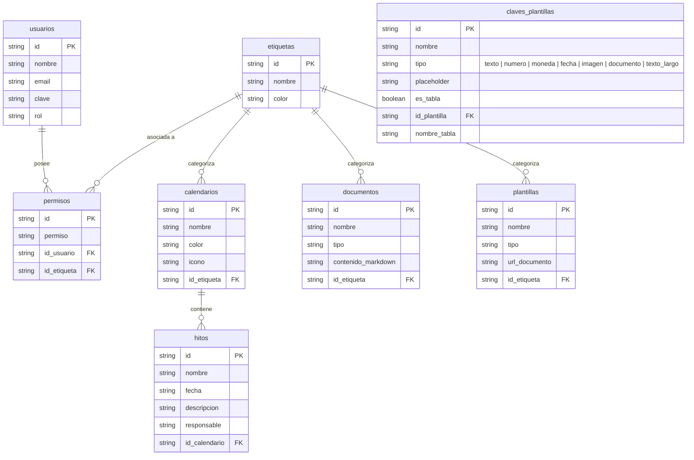

# Estructura de datos para Google Sheets

Este proyecto tiene una buena base para trabajar con Google Sheets, pero conviene separar la lógica de acceso a datos de la lógica de los componentes. La forma más simple y escalable es definir un manifiesto de tablas, con nombres, campos, rangos y relaciones.

## Recomendación

Usar un archivo JSON de configuración como contrato de base de datos para la UI. De esa forma, los componentes no tienen que saber nombres de columnas ni rangos a mano; solo llaman a funciones reutilizables como:

- `getTable('usuarios')`
- `getById('calendarios', id)`
- `getByRelation('permisos', 'id_usuario', usuarioId)`
- `saveTable('hitos', payload)`

Esto evita repetir lógica en cada componente y hace más mantenible el proyecto cuando crezca el número de conexiones a Google Sheets.

## Formato recomendado

El formato más adecuado aquí es JSON, porque:

- es fácil de versionar,
- es legible para un equipo,
- permite describir rangos y relaciones,
- se puede consumir desde Nuxt con funciones centralizadas,
- sirve como contrato para tablas, campos y claves foráneas.

## Estructura base

Se recomienda una estructura como esta:

```json
{
  "version": 1,
  "database": "portal2",
  "tables": [
    {
      "name": "usuarios",
      "range": "usuarios!A:Z",
      "primaryKey": "id",
      "fields": [
        { "name": "id", "type": "string" },
        { "name": "nombre", "type": "string" }
      ]
    }
  ]
}
```

## Regla general

- Un sheet = una tabla.
- La primera fila del sheet = cabeceras.
- Cada columna debe tener un nombre estable.
- Las relaciones se resuelven con IDs (`id_usuario`, `id_etiqueta`, `id_calendario`).
- La clave primaria de cada tabla debe ser `id`.

## Modelo de datos del proyecto



  `tipo` determina el control generado al llenar una plantilla. Los valores admitidos son `texto`, `numero`, `moneda`, `fecha`, `imagen`, `documento` y `texto_largo`. Los campos `imagen` y `documento` almacenan una URL o referencia; la aplicación no carga archivos binarios.

  Cuando `es_tabla` es `true`, la clave se muestra como una columna repetible dentro de una tabla y el usuario puede agregar filas. Cada celda conserva el control determinado por `tipo`.

  `nombre_tabla` agrupa las claves repetibles que forman parte de la misma tabla. En la creación de plantillas se solicita cuando `es_tabla` está activado.

## Tabla de configuración sugerida

```json
{
  "tables": [
    {
      "name": "usuarios",
      "range": "usuarios!A:Z",
      "primaryKey": "id",
      "fields": [
        "id",
        "nombre",
        "email",
        "clave",
        "rol"
      ]
    },
    {
      "name": "permisos",
      "range": "permisos!A:Z",
      "primaryKey": "id",
      "fields": [
        "id",
        "permiso",
        "id_usuario",
        "id_etiqueta"
      ]
    }
  ]
}
```

## Resultado práctico

Con esto, el acceso desde los componentes queda mucho más resumido, por ejemplo:

```ts
const { getTable, getById } = useSheets()

const usuarios = await getTable('usuarios')
const usuario = await getById('usuarios', 'u_001')
```

En lugar de repetir manualmente cada fetch con `range` y convertir filas en objetos cada vez.

## Siguiente paso recomendado

1. Crear una hoja llamada `usuarios` con cabeceras exactas.
2. Crear el mismo patrón para `etiquetas`, `permisos`, `calendarios`, `hitos`, `documentos`, `plantillas` y `claves_plantillas`.
3. Mantener el archivo JSON como fuente de verdad para todas las consultas.
4. Centralizar la carga en `composables/useSheets.ts` para que cada componente solo use funciones de dominio.

El archivo JSON de referencia ya está en `docs/google-sheets-estructura.json`.
